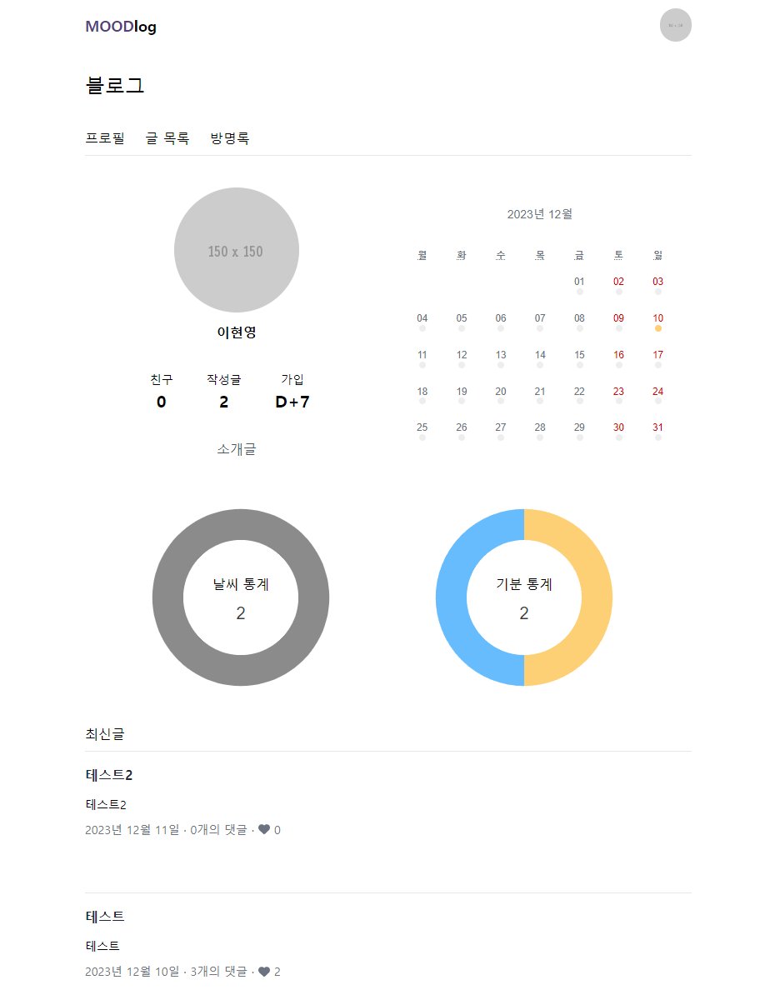

# MOODlog
2023년 2학기 웹시스템설계 팀 프로젝트  

## 프로젝트 소개
'MOODlog'는 MOOD와 Blog의 합성어로 사용자가 매일 일기를 작성하기 위해 사용하는 블로그형 SNS입니다. 매일 작성하는 일기에서 날씨와 감정 정보를 받아 통계 자료 및 프로필을 제공하며 댓글, 방명록, 친구 추가 기능을 통해 친구와 상호작용할 수 있습니다.

## 개발 기간
2023.11.30 ~ 2023.12.10

## 기능
### 1. 로그인
* 이메일 인증을 통하여 회원가입 진행
  
### 2. 개인 별 블로그
* 친구 수, 작성글 수, 가입일 수와 같은 정보 제공
* 최근 작성한 글, 전체 작성 글, 방명록 등의 기능 제공

### 3. 관리자 페이지
* 블로그 정보 변경 및 개인 정보(비밀번호) 변경
* 친구 추가, 친구 신청 수락 및 취소, 친구 목록 확인 및 삭제

## 실행 화면
  